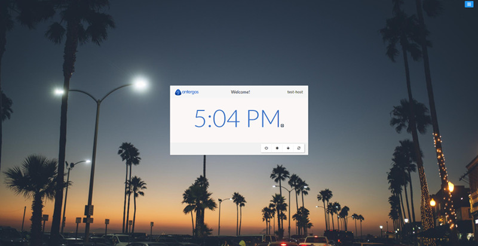
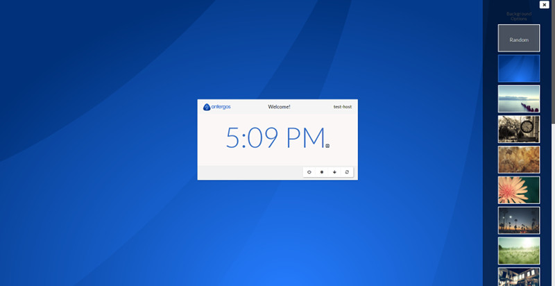
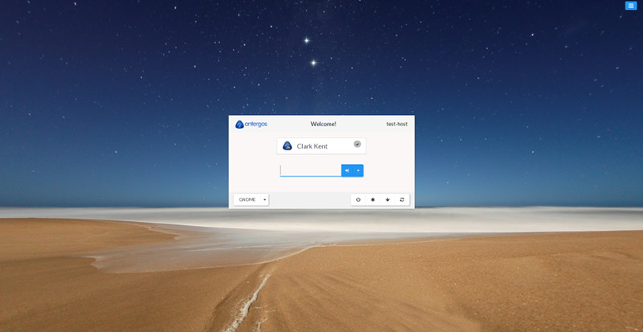

# lightdm-webkit-theme-antergos
[](https://github.com/Antergos/lightdm-webkit-theme-antergos/releases/tag/2.3.0) [](https://github.com/Antergos/lightdm-webkit2-greeter/blob/master/LICENSE)


### Overview

This is the default theme included with [lightdm-webkit2-greeter](http://github.com/Antergos/lightdm-webkit2-greeter). If you are using the Webkit2 greeter, you already have this theme.

### Screenshots
<center>

<hr/>

<hr/>

</center>

### Prerequisites
* lightdm-webkit-greeter

### Installation
This theme is included with `lightdm-webkit2-greeter` which is installed by default for Antergos users. Non-Antergos users should see [lightdm-webkit2-greeter](https://github.com/Antergos/lightdm-webkit2-greeter/) for install details.

#### ***NOTE:*** 
The last version of this theme which supports the legacy Webkit1 greeter is [v2.3.2](https://github.com/Antergos/lightdm-webkit-theme-antergos/releases/tag/2.3.2).
Versions of this theme later than ***2.3.2*** will not work with the legacy Webkit1 greeter. If you want to use the latest version of the theme you must use the Webkit2 greeter.

#### To use [v2.3.2](https://github.com/Antergos/lightdm-webkit-theme-antergos/releases/tag/2.3.2) of this theme with the legacy Webkit1 greeter:

1. Download [Antergos Theme](https://github.com/Antergos/lightdm-webkit-theme-antergos/archive/2.3.2.zip)
2. Unzip it. This should create a folder named like `Antergos-lightdm-webkit-theme-antergos-2.3.2`.
3. Rename this folder to `antergos` and copy move it to the themes directory (so that the complete path becomes `/usr/share/lightdm-webkit/themes/antergos`)
4. Edit  `/etc/lightdm/lightdm-webkit-greeter.conf` and set the `webkit-theme` property to `antergos`:

```
[greeter]
webkit-theme=antergos

```

Optionally you can install the included font `Lato`.

Now if you restart your computer (or at least if you restart lightdm), the antergos greeter theme should be activated. 


### User Icons Management

To change users icons:

* Create a resource named with the user's login in `/var/lib/AccountsService/icons/`
* Edit `/var/lib/AccountsService/users/<userLogin>` and add a property `Icon` targeting the icon resource you just created.

This theme works well with 96x96 images.

### Translations

Translations are managed through [Transifex](https://www.transifex.com/faidoc/antergos). Please do not submit PR for translations.

